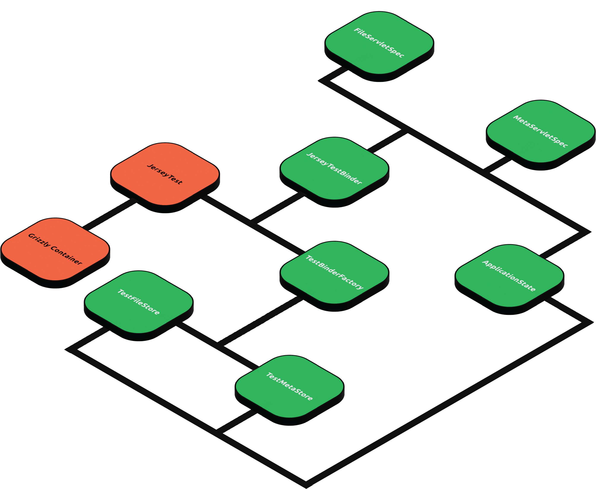

{:toc}

Groovy Spock
------------

We're _big_ believers in testing our code, both for correctness, as well as to ensure that changes don't unintentionally
break existing contracts unintentionally. For example, we rely heavily on the [Spock][Spock]
framework for our backend service tests, and see a lot of benefit from it's conciseness, built-in [mocking framework][mocking framework], and the fact that it uses [Groovy][Groovy]. :smile:

We also strive for very high-quality code, with the belief that quality code is easier to maintain, easier to
understand, and has fewer bugs. To help keep the quality bar high. For instance we have an automated style checker
([Checkstyle][Checkstyle]) in our Maven-based projects with rules that _should_ catch most of the common style issues.

The testing utilizes the following dependencies to enable Groovy Spock testing in Airstotle:

- [spock-bom][BOM]
- [Groovy][Groovy]
- gmavenplus-plugin, which enables Maven lifecycle to scan and pick up, compile, and run relevant test files

All test dependencies are defined in the [top-level POM file][top-level POM] by following the
[official setup](https://github.com/spockframework/spock-example/blob/master/pom.xml):

> Note that the combination of Groovy and Spock versions are important because [some versions have been reported to be
> incompatible with each other](https://stackoverflow.com/a/53973345)

```xml
<project>

    ...
    
    <properties>
        <version.groovy>4.0.6</version.groovy>
    </properties>

    <dependencyManagement>
        <dependencies>
            <!-- Testing -->
            <dependency>
                <groupId>org.spockframework</groupId>
                <artifactId>spock-bom</artifactId>
                <version>2.4-M1-groovy-4.0</version>
                <type>pom</type>
                <scope>import</scope>
            </dependency>
            <dependency>
                <groupId>org.apache.groovy</groupId>
                <artifactId>groovy</artifactId>
                <version>${version.groovy}</version>
            </dependency>
            <dependency> <!-- Enable mocking of non-interface types -->
                <groupId>cglib</groupId>
                <artifactId>cglib-nodep</artifactId>
                <version>3.3.0</version>
            </dependency>
            <dependency> <!-- enables mocking of classes without default constructor (together with CGLIB) -->
                <groupId>org.objenesis</groupId>
                <artifactId>objenesis</artifactId>
                <version>3.0.1</version>
                <scope>test</scope>
            </dependency>
            <dependency> <!-- only necessary if Hamcrest matchers are used -->
                <groupId>org.hamcrest</groupId>
                <artifactId>hamcrest-all</artifactId>
                <version>1.3</version>
                <scope>test</scope>
            </dependency>
        </dependencies>
    </dependencyManagement>

    <dependencies>
        <!-- Testing -->
        <dependency>
            <groupId>org.spockframework</groupId>
            <artifactId>spock-core</artifactId>
            <scope>test</scope>
        </dependency>
        <dependency>
            <groupId>org.apache.groovy</groupId>
            <artifactId>groovy</artifactId>
        </dependency>
        <dependency>
            <groupId>cglib</groupId>
            <artifactId>cglib-nodep</artifactId>
        </dependency>
        <dependency>
            <groupId>org.objenesis</groupId>
            <artifactId>objenesis</artifactId>
        </dependency>
    </dependencies>

    <build>
        <pluginManagement>
            <plugins>
                <!-- Groovy Spock -->
                <plugin>
                    <groupId>org.codehaus.gmavenplus</groupId>
                    <artifactId>gmavenplus-plugin</artifactId>
                    <version>2.1.0</version>
                    <executions>
                        <execution>
                            <goals>
                                <goal>compile</goal>
                                <goal>compileTests</goal>
                            </goals>
                        </execution>
                    </executions>
                </plugin>

                <!-- Unite Test -->
                <plugin>
                    <groupId>org.apache.maven.plugins</groupId>
                    <artifactId>maven-surefire-plugin</artifactId>
                    <version>${version.maven.surefire.plugin}</version>
                    <configuration>
                        <systemPropertyVariables>
                            <java.awt.headless>true</java.awt.headless>
                        </systemPropertyVariables>
                        <includes>
                            <include>%regex[.*Spec.*]</include>
                        </includes>
                        <excludes>
                            <exclude>%regex[.*ITSpec.*]</exclude>
                        </excludes>
                    </configuration>
                </plugin>
                <plugin>
                    <groupId>org.apache.maven.plugins</groupId>
                    <artifactId>maven-surefire-report-plugin</artifactId>
                    <version>${version.maven.surefire.report.plugin}</version>
                </plugin>

                <!-- Integration Test -->
                <plugin>
                    <groupId>org.apache.maven.plugins</groupId>
                    <artifactId>maven-failsafe-plugin</artifactId>
                    <version>${version.maven.failsafe.plugin}</version>
                    <executions>
                        <execution>
                            <goals>
                                <goal>integration-test</goal>
                                <goal>verify</goal>
                            </goals>
                        </execution>
                    </executions>
                    <configuration>
                        <includes>
                            <include>**/*ITSpec.*</include>
                        </includes>
                    </configuration>
                </plugin>
            </plugins>
        </pluginManagement>

        <plugins>
            <!-- Mandatory plugins for using Spock -->
            <plugin>
                <groupId>org.codehaus.gmavenplus</groupId>
                <artifactId>gmavenplus-plugin</artifactId>
            </plugin>
        </plugins>
    </build>

    ...
</project>
```

> It is also important to avoid transitive dependencies from overriding our own dependency declarations by using Mevne's
> `exclusion` tag. For example
>
> ```xml
> <dependency>
>     <groupId>io.rest-assured</groupId>
>     <artifactId>rest-assured</artifactId>
>     <version>5.3.0</version>
>     <scope>test</scope>
>     <exclusions>
>         <exclusion>
>             <groupId>org.apache.groovy</groupId>
>             <artifactId>groovy</artifactId>
>         </exclusion>
>     </exclusions>
> </dependency>
> ```
> 
> We can check for conflicting transitive dependencies, for example, using dependency analyzer plugin in IntelliJ:
> 
> {:class="img-responsive"}

Servlet Testing Documentation
-----------------------------

> The design of athena-core tests, servlet tests in particular, draws extensively from
> [fili](https://github.com/yahoo/fili/blob/master/fili-core/src/test/java/com/yahoo/bard/webservice/application/JerseyTestBinder.java)
>
> One noticeable deviation is that since some of Fili's classes have made it possible for themselves to be mutable,
> which Athena doesn't do, the stubbing is defined not on these classes, but on
> [ApplicationState](./src/test/java/com/qubitpi/athena/application/ApplicationState.java), which is a modified
> adaption of Fili ApplicationState

[Servlet-related testing](https://github.com/QubitPi/athena/tree/master/athena-core/src/main/java/com/qubitpi/athena/web/endpoints)
is carried out using
[Jersey Test Framework](https://qubitpi.github.io/jersey-guide/2022/07/11/jersey-test-framework.html).



Each
[`***ServletSpec.groovy`](https://github.com/QubitPi/athena/tree/master/athena-core/src/test/groovy/com/qubitpi/athena/web/endpoints)
follows the following pattern to setup, run, and shutdown tests:

### 1. Initialize ApplicationState

Test specs initializes test data and mocking through [ApplicationState](ApplicationState) in `setup()`

```groovy
def setup() {
    ApplicationState applicationState = new ApplicationState();
    applicationState.metadataByFileId = ...
    applicationState.queryFormatter = ...
    applicationState.mutationFormatter = ...

    ...
}
```

* `applicationState.metadataByFileId` initializes GraphQL DataFetcher data
* `queryFormatter` transforms a (file ID, metadata field list) pair to a native GraphQL query
* `mutationFormatter` transforms a (file ID, metadata object) pair to a native GraphQL query that persists a new
  metadata to database (or just in-memory that usually suffices in testing scenarios)

### 2. Create Test Harness

```groovy
def setup() {
    ...

    jerseyTestBinder = new JerseyTestBinder(true, applicationState, ***Servlet.class)
}
```

Executing the statement above will start a [Grizzly container](https://javaee.github.io/grizzly/). After that all Athena
endpoints are ready to receive test requests.

> 📋 When writing tests for [FileServlet](FileServlet), make sure `MultiPartFeature.class` is also passed in as a
> resource class since the file uploading involves a separate Jersey component enabled by it. For example:
> 
> ```java
> jerseyTestBinder = new BookJerseyTestBinder(true, FileServlet.class, MultiPartFeature.class)
> ```

The first boolean argument (`true`) is a flag to indicate whether or not, on executing the statement, servlet container
starts immediately. If we would like to defer the startup, change that to `false` and manually start the container later
by

```groovy
jerseyTestBinder.start()
```

Internally [JerseyTestBinder](JerseyTestBinder) sets [TestBinderFactory](TestBinderFactory) to bind those data and
behaviors into the actual test

> Note that the [JerseyTestBinder](JerseyTestBinder) creates separate container for each test. Setup method is named
> `setup()` and teardown method `cleanup()` by Groovy Spock convention.

### 3. Run Tests

To send test request in order to test endpoints, use `JerseyTestBinder.makeRequest` method, which returns a native
javax rs ws request object:

```groovy
def "File meta data can be accessed through GraphQL GET endpoint"() {
    when: "we get meta data via GraphQL GET"
    String actual = jerseyTestBinder.makeRequest(
            "/metadata/graphql",
            [query: URLEncoder.encode("""{metaData(fileId:"$FILE_ID"){fileName\nfileType}}""", "UTF-8")]
    ).get(String.class)

    then: "the response contains all requested metadata info without error"
    new JsonSlurper().parseText(actual) == new JsonSlurper().parseText(expectedMultiFieldMetadataResponse())
}
```

### 4. Teardown Tests

The teardown shuts down test cnotainer as well as cleaning up all ApplicationStates we defined in
[step 1](#1-initialize-applicationstate)

```groovy
def cleanup() {
    // Release the test web container
    jerseyTestBinder.tearDown()
}
```

Troubleshooting
---------------

### Adding Custom Resources to ResourceConfig

```
java.lang.IllegalStateException: org.glassfish.jersey.server.model.ModelValidationException: Validation of the
application resource model has failed during application initialization.
[[FATAL] No injection source found for a parameter of type public javax.ws.rs.core.Response

...

Caused by: org.glassfish.jersey.server.model.ModelValidationException: Validation of the application resource model has failed during application initialization.
```

Athena uses ResourceConfig type for configuration. We need to register the `MultiPartFeature`. Instead of using
[Athena ResourceConfig](ResourceConfig), servlet test spec configures with the native
[Jersey ResourceConfig](JerseyResourceConfig). The reason is so that we could bind certain resource classes that we only
need in a test spec to enhance test efficiency.

Athena ResourceConfig registers MultiPartFeature by default, whereas Jersey ResourceConfig does not. We could register
this resource as an extra resource class using

```groovy
jerseyTestBinder = new JerseyTestBinder(true, applicationState, FileServlet.class, MultiPartFeature.class)
```

Note that along with the `FileServlet` resource that's going to be registered and tested, `MultiPartFeature` will also
got registered by Jersey ResourceConfig.

### Test Hit 404 on Endpoint Tests

Believed it or not, you might have a local service that has already occupied the test port. For example, if we set
test port to 8080, it might very likely happen.

Another place to look at is the detailed error message. Aristotle uses [REST Assured][REST Assured] to send all test
requests. The example stacktrace blow, for example, tells that the Assured is not sending against the right port,
because the port is a unrealistic `-1`.

```
Expected status code <200> but was <404>.

	at com.qubitpi.aristotle.examples.basic.JettyServerFactorySpec.Factory produces Jsersey-Jetty applications(JettyServerFactorySpec.groovy:47)

[INFO]
[INFO] Results:
[INFO]
[ERROR] Failures:
[ERROR]   JettyServerFactorySpec.Factory produces Jsersey-Jetty applications:47 Condition failed with Exception:

RestAssured .when() .get("/v1/example/test")
|            |       |
|            |       <io.restassured.internal.RestAssuredResponseImpl@6bb8a6bf logRepository=io.restassured.internal.log.LogRepository@398897f3 groovyResponse=io.restassured.internal.RestAssuredResponseOptionsGroovyImpl@4f4ba7d7>
|            <io.restassured.internal.RequestSpecificationImpl@4fb20292 baseUri=http://localhost path=/v1/example/test method=GET basePath= unnamedPathParamsTuples=[] defaultAuthScheme=io.restassured.authentication.NoAuthScheme@16b514b6 port=-1 requestParameters=[:] queryParameters=[:] formParameters=[:] namedPathParameters=[:] httpClientParams=[http.protocol.allow-circular-redirects:false, http.protocol.handle-redirects:true, http.protocol.max-redirects:100, http.protocol.reject-relative-redirect:false, http.protocol.cookie-policy:ignoreCookies, http.protocol.cookie-datepatterns:[EEE, dd-MMM-yyyy HH:mm:ss z, EEE, dd MMM yyyy HH:mm:ss z]] authenticationScheme=io.restassured.authentication.NoAuthScheme@992c3a8 responseSpecification=io.restassured.internal.ResponseSpecificationImpl@50d3925c requestHeaders=Accept=*/* cookies= requestBody=null filters=[io.restassured.internal.filter.CsrfFilter@3371cd19, io.restassured.filter.time.TimingFilter@77642670, io.restassured.internal.filter.SendRequestFilter@2cf8eb66] urlEncodingEnabled=true restAssuredConfig=io.restassured.config.RestAssuredConfig@522d6d8d multiParts=[] parameterUpdater=io.restassured.internal.support.ParameterUpdater@6f896bd4 proxySpecification=null logRepository=io.restassured.internal.log.LogRepository@398897f3 httpClient=org.apache.http.impl.client.DefaultHttpClient@5240e87f allowContentType=true addCsrfFilter=true>
class io.restassured.RestAssured
```

[ApplicationState]: https://github.com/QubitPi/athena/blob/master/athena-core/src/test/java/com/qubitpi/athena/application/ApplicationState.java
[JerseyTestBinder]: https://github.com/QubitPi/athena/blob/master/athena-core/src/test/java/com/qubitpi/athena/application/JerseyTestBinder.java
[TestBinderFactory]: https://github.com/QubitPi/athena/blob/master/athena-core/src/test/java/com/qubitpi/athena/application/TestBinderFactory.java
[ResourceConfig]: https://github.com/QubitPi/athena/blob/master/athena-core/src/main/java/com/qubitpi/athena/application/ResourceConfig.java
[JerseyResourceConfig]: https://github.com/eclipse-ee4j/jersey/blob/master/core-server/src/main/java/org/glassfish/jersey/server/ResourceConfig.java
[FileServlet](https://github.com/QubitPi/athena/blob/master/athena-core/src/main/java/com/qubitpi/athena/web/endpoints/FileServlet.java)

[BOM]: (https://qubitpi.github.io/jersey-guide/2022/09/05/maven-bom.html)

[Checkstyle]: http://checkstyle.sourceforge.net/

[Groovy]: http://www.groovy-lang.org/

[mocking framework]: http://spockframework.org/spock/docs/1.1-rc-2/interaction_based_testing.html

[REST Assured]: https://rest-assured.io/

[Spock]: http://spockframework.org/

[top-level POM]: https://github.com/QubitPi/aristotle/blob/master/pom.xml
